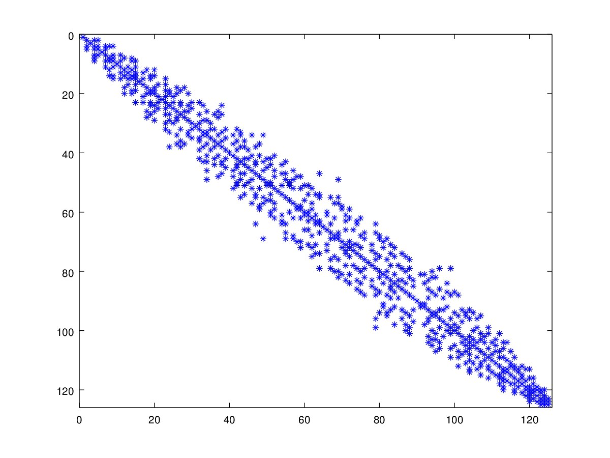
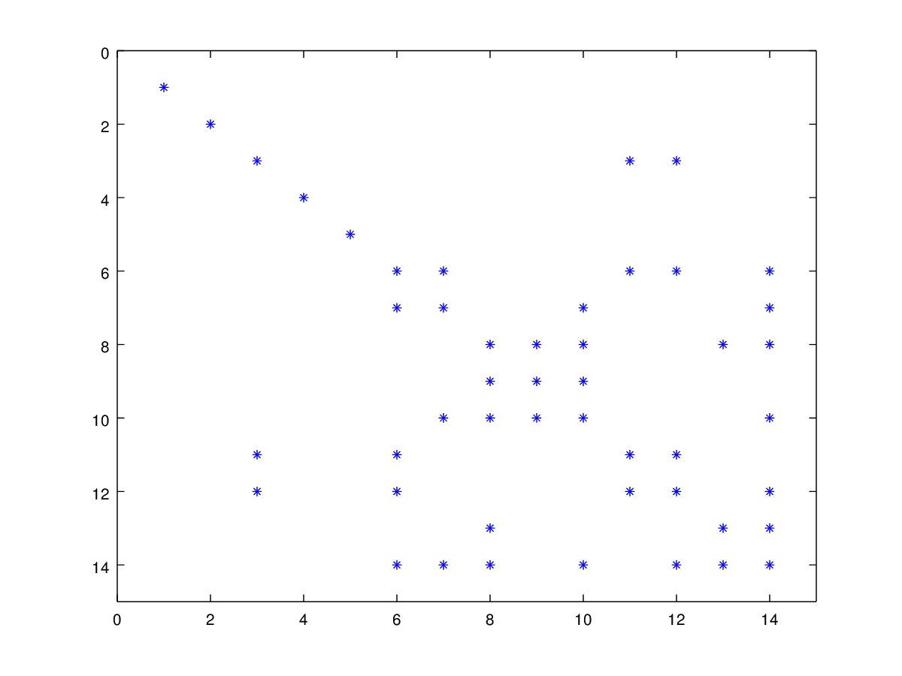

# Tarea 5 - Computo Paralelo
## Rubén Pérez Palacios - 19 Mayo 2022 - Profesor: Luis Daniel Blanco Cocom

### Introducción

Se implemento el metodo de gradiente conjugado, para resolver un sistema de ecuaciones de la forma $Ax = b$, donde $A \in M_{N\times N}, x,b\in R^N$. Debido a que el método necesita que $A$ sea simétrica definida positiva se uso del precondicionador de Jacobi para asegurarlo.

### Compilación

El algoritmo lee de un archivo $.mat$ la matriz $A$ (en su forma compresa por coordenadas), el vector $b$ y la solución $x$. Cuyo nombre se tiene que pasar como parámetro.

Comando para compilar:

- g++ -std=c++11 -fopenmp conjugate_gradient_jacobi.cpp -o conjugate_gradient_jacobi

Compando para ejecutar:

- conjugate_gradient_jacobi.exe RUTA

Donde RUTA es la la dirección relativa donde se encuentra el archivo .mat

### Código

Se implemento una clase para almacenar una Matriz en su forma "Compressed Row Storage":

``` cpp
class CRS
{
public:
    int N, M; //Dimensiones
    vector < vector < int > > indexJ; //Matriz de indices de columnas
    vector < vector < double > > vals; //Valores distintos a 0
    vector < double > diag; //Valores de la diagonal

    //Convertir una matriz comprimida por coordenadas a por renglones
    void fill_from_sparse(int N, int M, int nonzero, double* vals,
     double* indexI, double* indexJ)
    {
        this->N = N;
        this->M = M;
        this->indexJ.resize(N);
        this->vals.resize(N);
        diag.resize(N);

        for (int k = 0; k < nonzero - 1; k++)
        {
            this->indexJ[indexI[k] - 1].push_back(indexJ[k] - 1);
            this->vals[indexI[k] - 1].push_back(vals[k]);
            if (indexI[k] == indexJ[k])
                diag[indexI[k]-1] = vals[k];
        }
    }
};
```

Se implementó en c++ el último pseudocódigo de las diapositivas de la sesión 5 del metodo de gradiente conjugado con precondicionador de Jacobi, cuya función es:

``` cpp
void conjugate_gradient_jacobi(CRS A, vector < double >& x,
 vector < double > b, int max_iter, double eps)
{
    //...
}
```

En la cual se paralelizo:

- La inicialización de $r,M,q,p,dot_rr,dot_rq$ con `#pragma omp parallel for default(shared) reduction(+:dot_rr, dot_rq)`
- El producto $Ap_k$ con `#pragma omp parallel for default(shared) reduction(+:dot_pow)`
- La actualización de $x,r,q,new_dot_rr,new_dot_rq$ con `#pragma omp parallel for default(shared) reduction(+:new_dot_rr,new_dot_rq)`
- La actualización de $p$ con `#pragma omp parallel for default(shared)`

Además se implementó una función para leer la matriz $A$ y los vector $b,x$ del archivo ".mat" proporcionado como argumento. Cuya función es: 

``` cpp

void read_system_eq(const char* filename, CRS& A, vector < double >& b,
 vector < double >& x)
{
    //...
}
```

Por último se implementaron las funciones:

- `to_vector()`: Convierte un arreglo dinámico a un vector.
- `norm_inf()`: Devuelve la norma infinito de un vector.
- `norm_2()`: Devuelve la norma euclidiana de un vector.

### Errores

Los errores de la solución encontradas por el método son:

| Archivo | $L_2$ | $L_{\infty}$|
|---------|-------|-------------|
| new_heat_sparse | 0.4193 | 0.0982 |
| new_small_sparse | 1.9987e-17 | 1.0408e-17 |

### Datos

Las ecuaciones paras las que se obtuvieron su solucion son:




