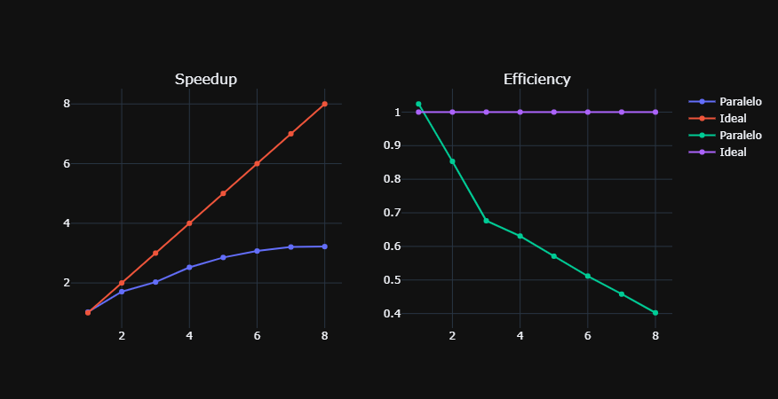

# Proyecto Final: Metaheurísticas en Paralelo - Recocido Simulado

## Rubén Pérez Palacios

### Introducción

Recocido Simiulado es un algoritmo estocástico de optimización global. Un algoritmo de optimización estocástico global, es aquel que apartir de movimientos aletorios trata de encontrar un óptimo global.

El algoritmo está insipirado por el recocido en metalurgia. En el cuál se excitan los atomos rapidamente en el material a alta temperatura, permitiendo que que los atomos se muevan mucho. Después se disminuye su excitación lentamente permitiendo que se establescan en una configuración mas estable. Finalmente se determina si el nuevo estado es “mejor” de manera probabilística.

### Algoritmo

Parámetros iniciales. Condiciones iniciales y de término.

``` cpp
double T_init = 1.0; // Temperatura inicial
double T_min = 1e-10; // Temperatura final de paro
double F_min = -1e+100; // Valor minimo de la funcion (cerca de 0)
int max_rej = 2500; // Maximo numero de rechazos
int max_run = 500; // Maximo numero de iteraciones
int max_accept = 15; // Maximo numero de aceptaciones
double k = 1.0; // Constante de Bolztmann
double alpha = 0.95; // Factor de Enfriamiento
double Enorm = 1e-8; // Norma minima de energio
double f_opt; // Optimo encontrado
vector < double > tmin{ 0.0, 0.0, 0.0, 0.0, 0.0 }, tmax{ 0.5, 0.2, 1.0, 1.14, 30.0 };
//Rangos de busqueda

//Funciones para generar valores aletorios
random_device rd_1{}, rd_2{};
mt19937 gen_normal1{ rd_1() }, gen_uniform1{ rd_2() }; //semillas
default_random_engine gen_normal, gen_uniform; //semillas
normal_distribution<double> randn(0.0, 1.0); // Numeros aleatoris dist normal estandar
uniform_real_distribution<double> randu(0.0, 1.0); // Numeros aleatoris dist uniforme stndr
double normal_factor;  // Variable de auxilo
```

Funciones Objetivo. Funciones a optimizar.

``` cpp
string function_type = "Celda";

// Cuadrado de un numero
double sq(double x)
{
    return x * x;
}

//Función de Rosenbrock
double f(const vector < double > &x)
{
    return sq(1 - x[0]) + 100 * sq(x[1] - sq(x[0]));
}

//Función de Sinoidal
double f(const vector < double >& x)
{
    return sq(x[0]) + sq(x[1]) + 3.0 * sqrt(sq(sin(5 * x[0])) + sq(sin(5 * x[1]))) + 0.1;
}

double V(const vector < double >& x, double i)
{
    return x[0] - x[1] * log2(i) - x[2] * i + x[3] * log(1 - x[4] * i);
}

int M; // Cantidad de datos
vector < pair < double, double > > V_density;
// Función Celda
double f(const vector < double >& x)
{
    double ans = 0;
    for (int i = 0; i < M; i++)
        ans += sq(V_density[i].second - V(x, V_density[i].first));
}
```

Código Principal. Variables de apoyo. Definición de la función principal

``` cpp
vector < double > sim_annealing(const vector < double >& x_0)
{
    // Temperatura actual
    double T = T_init;

    // Métricas
    double E_init = f(x_0);
    double E_old = E_init, E_new = E_old;

    // solucion candidata
    vector < double > x = x_0;
    vector < double > next_x(x.size());

    // Contadores
    int i = 0, j = 0, accept = 0, totaleval = 0;

    //Inicio del Recocido Simulado
    while ((T > T_min) && (j <= max_rej) && E_new > F_min)
    {
        i++;

        // Comprobar si el numero de aceptados/ejecuciones se alcanzaron
        if ((i >= max_run) || (accept >= max_accept))
        {
            //Enfriar temperatura
            T = alpha * T;
            //Resetear y actualizar contadores
            totaleval = totaleval + i;
            i = 1;
            accept = 1;
        }

        // Siguiente perturbación de la solucion actual
        normal_factor = randn(gen_normal1);
        for (int x_i = 0; x_i < x.size(); x_i++)
            next_x[x_i] = max(tmin[x_i], min(tmax[x_i], x[x_i] +
            randu(gen_uniform1) * normal_factor));

        // Metricas de comparación
        E_new = f(next_x);
        double DeltaE = E_new - E_old;

        // Aceptación en caso de que el nuevo punto sea mejor
        if (-DeltaE > Enorm)
        {
            x = next_x;
            E_old = E_new;
            accept++;
            j = 0;
        }

        // Aceptación en caso de que el nuevo punto sea peor probabilisticamente
        if (DeltaE <= Enorm && exp(-DeltaE / (k * T)) > randu(gen_uniform1))
        {
            x = next_x;
            E_old = E_new;
            accept++;
        }
        // Rechazo
        else
            j++;

        // Actualización de valor de la función en el solucion candidata
        f_opt = E_old;
    }

    return x;
}
```

Paralelización del código. Para paralelizar el código se realizo $P$ veces la estimación del óptimo global con $P$ diferentes puntos iniciales. Se decidio no paralelizar la actualización del punto puesto que su dimensión es muy pequeña y el ovearhead es mucho. Cuyo código es

``` cpp
int main()
{

    int P = 2000, N = 5;
    omp_set_num_threads(8);

    ifstream f_in("datos_358.txt");
    ofstream f_out("./outputs/3_P_8.out");

    vector<vector<double>> x_0(P, vector<double>(N, 2));
#pragma omp parallel for default(shared)
    for (int i = 0; i < P; i++)
        for (int j = 0; j < N; j++)
            x_0[i][j] = randu(gen_uniform) * (tmax[j] - tmin[j]) + tmin[j];

    if (function_type == "Celda")
    {
        double tx, ty;
        while (f_in >> tx >> ty)
        {
            V_density.push_back({ tx, ty });
            M++;
        }
    }

    auto start_time = steady_clock::now();

    vector < double > opt, ans = x_0[0];

#pragma omp parallel for default(shared)
    for (int i = 0; i < P; i++)
    {
        opt = sim_annealing(x_0[i]);
        if (f(opt) < f(ans))
            ans = opt;
    }

    auto end_time = steady_clock::now();

    for (auto a : ans)
        f_out << a << " ";
    f_out << "\n";
    f_out << f(ans) << "\n";

    auto total_time = duration_cast<microseconds>(end_time - start_time).count();

    f_out << total_time;

    return 0;
}
```

### Resultados

Los resultados obtenidos son:

- Función Rosenbrock

    | tipo | x | f(x)|
    |-----|---------|-------------|
    | serial | (1,1) | 2.67655e-12 |
    | paralelo | (1.00001, 1.00001) | 9.41174e-11 |

    

- Función Sinoidal

    | tipo | x | f(x)|
    |-----|---------|-------------|
    | serial | (7.37331e-06, 3.79718e-06) | 0.100124 |
    | paralelo | (8.86316e-06, 5.75408e-06) | 0.100159 |

    

- Función Sinoidal (SSE)

    | tipo | x | f(x)|
    |-----|---------|-------------|
    | serial | (0.49624, 0.0318095, 0.288509, 0.182689, 27.3963) | 0.00981703 |
    | paralelo | (0.488625, 0.03195, 0.365753, 0.174653, 27.6357) | 0.00908208 |

    

### Tiempos y Métricas

Los tiempos obtenidos de ejecución


Cuyas gráficas de Speedup y Efficiency son:

- Función Rosenbrock

    

- Función Sinoidal

    

- Función Sinoidal (SSE)

    

### Conclusiones y bibliografía

Podemos ver que aunque si se mejoro el tiempo de ejecución en las estimaciones de las 3 funciones, y también se cálculo una solución muy cercana al del serial. Con el aumento de la población se podría ver una mejora en el Speedup y Efficiency. La estimación de los optimos globales fue bastante bueno en general, con resultados muy cercanos al real.

Las fuentes usadas fueron:

1. https://machinelearningmastery.com/simulated-annealing-from-scratch-in-python/
2. https://www.mit.edu/~dbertsim/papers/Optimization/Simulated%20annealing.pdf
3. https://www.researchgate.net/publication/220698180_Implementing_a_Parallel_Simulated_Annealing_Algorithm/link/5a47e4ba458515f6b0569d73/download
4. https://www.geeksforgeeks.org/simulated-annealing/